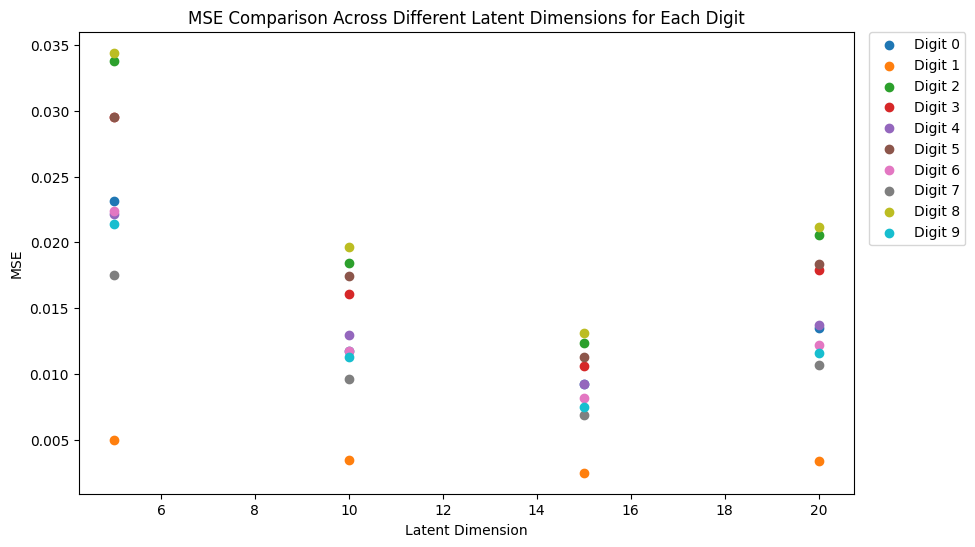
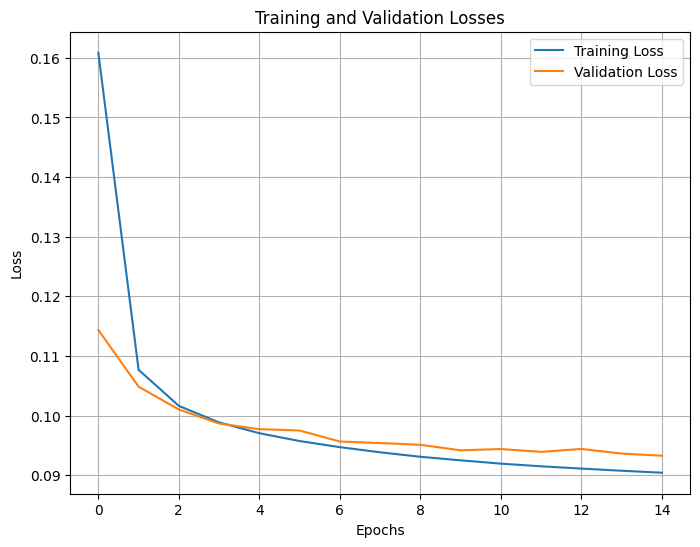
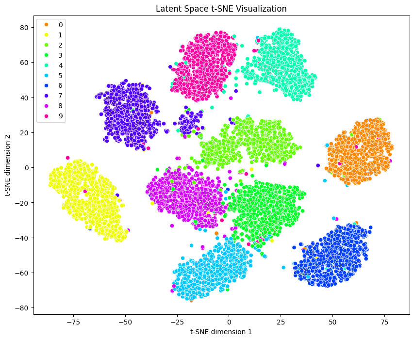
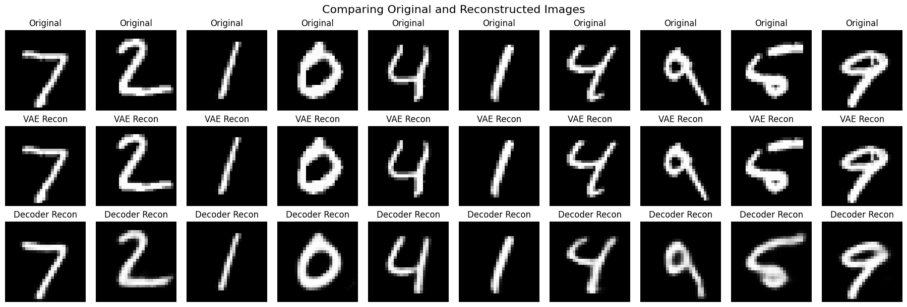

# **The End-to-End $\beta$-Variational Autoencoder (VAE)**

  

An exploration into the fascinating world of generative models with a focus on constructing a **$\beta$-Variational Autoencoder ($\beta$-VAE)** to interpret and recreate the **MNIST** dataset of handwritten digits.

## Introduction to Variational Autoencoders

Variational Autoencoders (VAEs) are a class of generative models that not only learn the intricacies of data but also its underlying probability distribution. By encoding data into a latent (hidden) space, they reduce dimensionality and capture the essence of data, which can then be used to generate new samples that were never seen during training but share the same statistical properties.

The MNIST dataset is a cornerstone in the field of machine learning, providing a large set of 28x28 pixel grayscale images of handwritten digits (0-9). It's widely used for training and testing in the domain of computer vision, particularly for algorithms that involve image recognition.

Generative AI encompasses models that can produce content. These models learn to capture the probability distribution of the training data and can generate new data points with variations. This has profound implications across fields such as design, art, and even data augmentation for machine learning models.

The core structure of a variational autoencoder comprises five components, as illustrated in the diagram sourced from Wikipedia.

  

## Purpose of This Repository

The mission of this repository is to explore the capabilities of $\beta$-VAEs within the realm of generative AI, using the MNIST dataset as a proving ground. My aim is to:

- Understand the nuances of VAEs and their role in generative AI.
- Experiment with various latent space dimensions to identify the optimal configuration for digit reconstruction.
- Visualize the latent space to gain insights into the data representation learned by the VAE.
- Compare the reconstruction quality of a full VAE against a decoder-only model to understand the impact of each component.

## Optimal Latent Space Dimension for VAE Model

In the quest for the most effective Variational Autoencoder (VAE) model for digit reconstruction on the MNIST dataset, a comprehensive analysis was conducted to determine the optimal size of the latent space. Through experimentation with various latent dimensions, the goal was to find a balance between reconstruction accuracy and model complexity.

### Comparative Analysis of Latent Dimensions

The VAE model's performance was rigorously evaluated across four different latent space dimensions: 5, 10, 15, and 20. For each of these configurations, the model was trained, and two key metrics were calculated for the reconstructed images:

- **Mean Squared Error (MSE):** Measures the average of the squares of the errors—that is, the average squared difference between the estimated values and the actual value.
- **Peak Signal-to-Noise Ratio (PSNR):** Used to measure the quality of reconstruction, where a higher PSNR indicates better quality.

Both metrics were computed for 10 representative images from each digit class (0 through 9), providing a clear insight into the model's reconstruction capabilities for varying complexities of the digit structures.

### Insights and Visualizations

The following visualizations encapsulate the model's performance, detailing how each latent dimension fared in reconstructing the digits.

*Figure 1: MSE values across different latent dimensions.*

*Figure 2: PSNR values across different latent dimensions.*

### Conclusion and Model Selection

After careful consideration of the reconstruction quality—indicated by lower MSE and higher PSNR values—the latent dimension of **15** emerged as the most suitable choice. This dimension demonstrated a superior balance, offering high-fidelity reconstructions while maintaining a parsimonious model complexity, thereby preventing overfitting.

Digit **1** consistently showed the highest reconstruction accuracy across all latent dimensions, while digit **8** presented the most significant challenge, likely due to its intricate loops and curves.

The insights derived from this analytical process have been pivotal in optimizing the VAE model for practical deployment, ensuring high-quality digit reconstructions with an optimized neural network architecture.

## Training and Validation Losses

*Figure 3: Training and Validation Losses.*

This plot illustrates the progression of training and validation losses over 15 epochs in the training of the **VAE** model for a latent space with 15-dimension.
The losses are indicative of the model's performance—the lower the loss, the better the model's predictions align with the actual data.

## t-SNE Clustering Visualisation

*Figure 4: t-SNE Clustering Visualisation.*

This visualisation presents the results of a **t-SNE (t-Distributed Stochastic Neighbour Embedding)** analysis applied to the high-dimensional data.
t-SNE is a powerful dimensionality reduction technique that enables the high-dimensional data to be visualized in two dimensions.

### Insights from the Visualisation:

- **Distinct Clusters**: Each cluster corresponds to data points that are similar to each other, with the t-SNE algorithm revealing the inherent groupings in the data.
- **Color-Coded Categories**: The points are color-coded from 0 to 9, representing ten unique classes within the dataset. The clear separation between clusters indicates a well-defined distinction between the categories in the high-dimensional space.
- **Axis Interpretation**: The axes, labeled 't-SNE dimension 1' and 't-SNE dimension 2', represent the two principal dimensions derived from the high-dimensional data. These axes do not correspond to physical dimensions but are constructed to preserve the local relationships between data points.
- **Data Density**: The density and spread of the clusters provide insights into the variance within each category. Tight clusters indicate high similarity within the category, while spread-out clusters suggest more diversity.
- **Outliers**: Sparse points outside the main clusters may represent outliers or anomalies in the data, offering potential points of interest for further investigation.

## Comparative Visualization of Digit Reconstructions

*Figure 5: Original_Reconstructed_Images.*

This figure provides a comparative analysis of digit reconstructions, showcasing the original images alongside the reconstructed images from both a full Variational Autoencoder (VAE) and decoder-only models.

The upper portion of the figure displays the original digit images, serving as the ground truth for comparison. The middle section illustrates the reconstructed digits as generated by the full VAE model, capturing the essence of the original digits through the learned latent space.
The lower section presents the digits reconstructed solely from the decoder part of the VAE, focusing on the model's ability to generate images from a reduced representation.

By comparing the original and reconstructed images, we assess the fidelity with which the VAE and its decoder can reproduce the original data.

## Project Summary and Acknowledgements

This project represents a comprehensive exploration of the capabilities of $\beta$-Variational Autoencoders in the context of the MNIST dataset. Through extensive experimentation and analysis, I have developed a model that not only learns to effectively reconstruct digits but also offers insights into the latent structure of the data it represents.

## Contributing

I welcome contributions from individuals and communities alike. Whether it's improving the code, refining the models, enhancing documentation, or suggesting new features, your input is greatly appreciated. Please feel free to fork the repository, make changes, and submit pull requests. You can also open an issue to discuss potential changes or report bugs.

## Contact

Should you have any questions, feedback, or wish to discuss collaborative opportunities, please reach out to me via [GitHub Issues](https://github.com/mdhabibi) or email me directly at [habibi.physics@gmail.com](mailto:habibi.physics@gmail.com).

## License

This project is licensed under the [MIT License](LICENSE) - see the LICENSE file for details.

---

Thank you for your interest in our $\beta$-Variational Autoencoder project. I hope that it serves as a valuable resource for those interested in generative models and deep learning.

